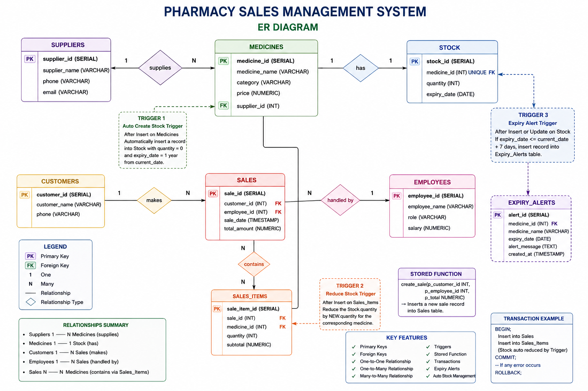

# Nexus Pharmacy Sales Management System

> **DBMS Final Project**
> A full-stack, cloud-based Pharmacy Sales Management System demonstrating advanced database concepts including Triggers, Stored Functions, Transactions, Normalization, and Role-Based Access Control.

---

## 📋 Table of Contents

1. [Abstract](#-abstract)
2. [Objectives](#-objectives)
3. [Technologies Used](#-technologies-used)
4. [System Architecture](#-system-architecture)
5. [Database Schema Design](#-database-schema-design)
6. [ER Diagram](#-er-diagram)
7. [Normalization](#-normalization)
8. [Triggers & Stored Functions](#-triggers--stored-functions)
9. [Transaction Management](#-transaction-management)
10. [CRUD Operations](#-crud-operations)
11. [Application Features](#-application-features)
12. [Role-Based Access Control](#-role-based-access-control)
13. [Project Structure](#-project-structure)
14. [Setup & Installation](#-setup--installation)
15. [Screenshots](#-screenshots)
16. [Conclusion](#-conclusion)

---

## 📄 Abstract

The **Nexus Pharmacy Sales Management System** is a modern, serverless web application designed to streamline pharmacy operations including inventory management, sales processing, customer tracking, and employee management. The system leverages a cloud-hosted **PostgreSQL** database via **Supabase** as the Backend-as-a-Service (BaaS), eliminating the need for a traditional backend server. The frontend is built using **React.js** with **Vite** as the build tool, featuring a premium **Glassmorphism UI** design. The project demonstrates the practical application of core DBMS concepts such as relational schema design, normalization (up to 3NF), triggers, stored procedures/functions, transactions (COMMIT/ROLLBACK), foreign key constraints, and role-based access control.

---

## 🎯 Objectives

1. Design and implement a **normalized relational database** (3NF) for pharmacy operations.
2. Demonstrate the use of **PostgreSQL Triggers** for automatic stock management and expiry alerts.
3. Implement **Stored Functions** for encapsulating business logic within the database layer.
4. Showcase **Transaction Management** with COMMIT and ROLLBACK operations.
5. Build a full-stack application with **CRUD operations** on all major entities.
6. Implement **Role-Based Access Control (RBAC)** with Customer and Manager login modes.
7. Deploy the database on the cloud using **Supabase** (Cloud PostgreSQL).
8. Develop a responsive and visually appealing **Single Page Application (SPA)** frontend.

---

## 🚀 Technologies Used

| Layer | Technology | Purpose |
|-------|-----------|---------|
| **Frontend Framework** | React.js 18 | Component-based UI development |
| **Build Tool** | Vite 5 | Fast development server & bundling |
| **Database** | PostgreSQL (via Supabase) | Relational data storage |
| **Backend-as-a-Service** | Supabase | Cloud-hosted PostgreSQL with REST API |
| **Client SDK** | @supabase/supabase-js | Direct DB communication from frontend |
| **UI Icons** | Lucide React | Scalable vector icons |
| **Styling** | Vanilla CSS | Glassmorphism / Antigravity design |
| **Language** | JavaScript (ES6+) | Application logic |
| **Version Control** | Git & GitHub | Source code management |

---

## 🏗️ System Architecture

```
┌──────────────────────────────────────────────────────┐
│                    CLIENT (Browser)                   │
│  ┌─────────────────────────────────────────────────┐ │
│  │           React.js + Vite (Frontend)            │ │
│  │  ┌──────────┐ ┌──────────┐ ┌────────────────┐  │ │
│  │  │  Login   │ │Dashboard │ │  CRUD Modules  │  │ │
│  │  │Component │ │  (Sales) │ │(Med/Cust/Emp)  │  │ │
│  │  └──────────┘ └──────────┘ └────────────────┘  │ │
│  └────────────────────┬────────────────────────────┘ │
│                       │                               │
│              supabaseClient.js                        │
│           (Supabase JS SDK - REST API)                │
└───────────────────────┼──────────────────────────────┘
                        │  HTTPS
                        ▼
┌──────────────────────────────────────────────────────┐
│              SUPABASE (Cloud Backend)                 │
│  ┌─────────────────────────────────────────────────┐ │
│  │         PostgreSQL Database Engine               │ │
│  │  ┌──────────┐ ┌──────────┐ ┌────────────────┐  │ │
│  │  │ Tables   │ │ Triggers │ │Stored Functions│  │ │
│  │  │ (7 total)│ │(3 active)│ │  (1 function)  │  │ │
│  │  └──────────┘ └──────────┘ └────────────────┘  │ │
│  └─────────────────────────────────────────────────┘ │
└──────────────────────────────────────────────────────┘
```

**Key Architectural Decision:** The system uses a **serverless architecture** — the React frontend communicates directly with the Supabase PostgreSQL database using the `@supabase/supabase-js` SDK, completely bypassing the need for a traditional Express.js/Node.js backend middleware layer.

---

## 🗄️ Database Schema Design

The database consists of **7 main tables** with well-defined relationships and constraints:

### Table Definitions

#### 1. Suppliers
| Column | Data Type | Constraint |
|--------|-----------|------------|
| supplier_id | SERIAL | PRIMARY KEY |
| supplier_name | VARCHAR(100) | NOT NULL |
| phone | VARCHAR(15) | — |
| email | VARCHAR(100) | — |

#### 2. Medicines
| Column | Data Type | Constraint |
|--------|-----------|------------|
| medicine_id | SERIAL | PRIMARY KEY |
| medicine_name | VARCHAR(100) | NOT NULL |
| category | VARCHAR(50) | — |
| price | NUMERIC(10,2) | — |
| supplier_id | INT | FOREIGN KEY → Suppliers(supplier_id) (ON DELETE CASCADE) |

#### 3. Stock
| Column | Data Type | Constraint |
|--------|-----------|------------|
| stock_id | SERIAL | PRIMARY KEY |
| medicine_id | INT | UNIQUE, FOREIGN KEY → Medicines(medicine_id) (ON DELETE CASCADE) |
| quantity | INT | NOT NULL |
| expiry_date | DATE | NOT NULL |

#### 4. Customers
| Column | Data Type | Constraint |
|--------|-----------|------------|
| customer_id | SERIAL | PRIMARY KEY |
| customer_name | VARCHAR(100) | — |
| phone | VARCHAR(15) | — |
| email | VARCHAR(100) | — |
| password_hash | VARCHAR(255) | — |

#### 5. Employees
| Column | Data Type | Constraint |
|--------|-----------|------------|
| employee_id | SERIAL | PRIMARY KEY |
| employee_name | VARCHAR(100) | — |
| role | VARCHAR(50) | — |
| salary | NUMERIC(10,2) | — |

#### 6. Sales
| Column | Data Type | Constraint |
|--------|-----------|------------|
| sale_id | SERIAL | PRIMARY KEY |
| customer_id | INT | FOREIGN KEY → Customers(customer_id) (ON DELETE CASCADE) |
| employee_id | INT | FOREIGN KEY → Employees(employee_id) (ON DELETE CASCADE) |
| sale_date | TIMESTAMP | DEFAULT CURRENT_TIMESTAMP |
| total_amount | NUMERIC(10,2) | — |

#### 7. Sales_Items
| Column | Data Type | Constraint |
|--------|-----------|------------|
| sale_item_id | SERIAL | PRIMARY KEY |
| sale_id | INT | FOREIGN KEY → Sales(sale_id) (ON DELETE CASCADE) |
| medicine_id | INT | FOREIGN KEY → Medicines(medicine_id) (ON DELETE CASCADE) |
| quantity | INT | — |
| subtotal | NUMERIC(10,2) | — |

#### 8. Expiry_Alerts (System-Generated)
| Column | Data Type | Constraint |
|--------|-----------|------------|
| alert_id | SERIAL | PRIMARY KEY |
| medicine_id | INT | — |
| medicine_name | VARCHAR(100) | — |
| expiry_date | DATE | — |
| alert_message | TEXT | — |
| created_at | TIMESTAMP | DEFAULT CURRENT_TIMESTAMP |

### Foreign Key Relationships

```
Suppliers ──(1:M)──→ Medicines
Medicines ──(1:1)──→ Stock
Customers ──(1:M)──→ Sales
Employees ──(1:M)──→ Sales
Sales     ──(1:M)──→ Sales_Items
Medicines ──(1:M)──→ Sales_Items
```

---

## 📊 ER Diagram



---

## 📐 Normalization

The database schema is normalized up to **Third Normal Form (3NF)**:

### First Normal Form (1NF)
- All tables have a **primary key** (SERIAL auto-increment).
- All columns contain **atomic (indivisible) values** — no multi-valued or composite attributes.
- Each row is **uniquely identifiable**.

### Second Normal Form (2NF)
- All tables satisfy 1NF.
- All **non-key attributes are fully functionally dependent** on the primary key.
- Example: In the `Sales_Items` table, `subtotal` and `quantity` depend on the composite context of `sale_id` + `medicine_id`, and are stored with their own primary key `sale_item_id`.

### Third Normal Form (3NF)
- All tables satisfy 2NF.
- **No transitive dependencies** exist.
- Example: `supplier_name` is not stored in `Medicines` — instead, `supplier_id` (FK) is used to reference the `Suppliers` table, eliminating transitive dependency.
- Example: Medicine details are not duplicated in `Sales_Items` — only `medicine_id` (FK) is stored.

---

## ⚡ Triggers & Stored Functions

### Trigger 1: Auto-Create Stock Entry (`trg_auto_create_stock`)

**Event:** AFTER INSERT on `Medicines`
**Purpose:** Automatically creates a corresponding row in the `Stock` table with quantity = 0 and a default expiry date of 1 year when a new medicine is added.

```sql
CREATE OR REPLACE FUNCTION auto_create_stock()
RETURNS TRIGGER AS $$
BEGIN
    INSERT INTO Stock(medicine_id, quantity, expiry_date)
    VALUES(NEW.medicine_id, 0, CURRENT_DATE + INTERVAL '1 year');
    RETURN NEW;
END;
$$ LANGUAGE plpgsql;

CREATE TRIGGER trg_auto_create_stock
AFTER INSERT ON Medicines
FOR EACH ROW
EXECUTE FUNCTION auto_create_stock();
```

---

### Trigger 2: Auto-Reduce Stock After Sale (`trg_reduce_stock`)

**Event:** AFTER INSERT on `Sales_Items`
**Purpose:** Automatically deducts the sold quantity from the `Stock` table when a sale item is recorded, ensuring real-time inventory accuracy.

```sql
CREATE OR REPLACE FUNCTION reduce_stock()
RETURNS TRIGGER AS $$
BEGIN
    UPDATE Stock
    SET quantity = quantity - NEW.quantity
    WHERE medicine_id = NEW.medicine_id;
    RETURN NEW;
END;
$$ LANGUAGE plpgsql;

CREATE TRIGGER trg_reduce_stock
AFTER INSERT ON Sales_Items
FOR EACH ROW
EXECUTE FUNCTION reduce_stock();
```

---

### Trigger 3: Expiry Alert Generator (`trg_expiry_alert`)

**Event:** AFTER INSERT OR UPDATE on `Stock`
**Purpose:** Monitors medicine expiry dates and automatically generates an alert in the `Expiry_Alerts` table if a medicine is expiring within 7 days.

```sql
CREATE OR REPLACE FUNCTION check_expiry_alert()
RETURNS TRIGGER AS $$
DECLARE
    med_name VARCHAR(100);
BEGIN
    IF NEW.expiry_date <= CURRENT_DATE + INTERVAL '7 days' THEN
        SELECT medicine_name INTO med_name
        FROM Medicines WHERE medicine_id = NEW.medicine_id;

        INSERT INTO Expiry_Alerts(medicine_id, medicine_name, expiry_date, alert_message)
        VALUES(NEW.medicine_id, med_name, NEW.expiry_date, 'Medicine expiring within 7 days');
    END IF;
    RETURN NEW;
END;
$$ LANGUAGE plpgsql;

CREATE TRIGGER trg_expiry_alert
AFTER INSERT OR UPDATE ON Stock
FOR EACH ROW
EXECUTE FUNCTION check_expiry_alert();
```

---

### Stored Function: Create Sale (`create_sale`)

**Purpose:** Encapsulates the sale creation logic as a reusable database function.

```sql
CREATE OR REPLACE FUNCTION create_sale(
    p_customer_id INT,
    p_employee_id INT,
    p_total NUMERIC
)
RETURNS VOID AS $$
BEGIN
    INSERT INTO Sales(customer_id, employee_id, total_amount)
    VALUES(p_customer_id, p_employee_id, p_total);
END;
$$ LANGUAGE plpgsql;
```

---

## 🔄 Transaction Management

The system demonstrates **ACID-compliant transactions** with both COMMIT and ROLLBACK scenarios:

### Transaction with COMMIT
```sql
BEGIN;

INSERT INTO Sales(customer_id, employee_id, total_amount)
VALUES(1, 1, 220);

INSERT INTO Sales_Items(sale_id, medicine_id, quantity, subtotal)
VALUES
  (1, 1, 2, 100),
  (1, 2, 1, 120);

COMMIT;
-- Both the sale and sale items are permanently saved.
-- The trg_reduce_stock trigger automatically reduces stock.
```

### Transaction with ROLLBACK
```sql
BEGIN;

INSERT INTO Sales(customer_id, employee_id, total_amount)
VALUES(2, 2, 500);

ROLLBACK;
-- The sale insertion is completely undone.
-- No data is persisted in the database.
```

---

## 📝 CRUD Operations

The application implements full **Create, Read, Update, Delete** operations on all major entities:

| Entity | Create | Read | Update | Delete |
|--------|--------|------|--------|--------|
| **Medicines** | ✅ Add via form | ✅ Master list with supplier & stock | ✅ Stock/Expiry update | ✅ Delete with cascade |
| **Customers** | ✅ Add via form + Sign Up | ✅ Customer database table | ✅ Profile via login | — |
| **Employees** | ✅ Add via form (Manager only) | ✅ Staff roster table | — | — |
| **Sales** | ✅ Record sale via dashboard | ✅ Purchase history per customer | — | — |
| **Suppliers** | ✅ Auto-created when adding medicine | ✅ Linked to medicines | — | — |

### Important SQL Queries Used

```sql
-- View all medicines with supplier info (JOIN)
SELECT m.medicine_name, s.supplier_name
FROM Medicines m
JOIN Suppliers s ON m.supplier_id = s.supplier_id;

-- Low stock alert query
SELECT * FROM Stock WHERE quantity < 20;

-- Sales report with customer and employee details (Multi-table JOIN)
SELECT sa.sale_id, c.customer_name, e.employee_name, sa.total_amount
FROM Sales sa
JOIN Customers c ON sa.customer_id = c.customer_id
JOIN Employees e ON sa.employee_id = e.employee_id;

-- Aggregate: Total revenue
SELECT SUM(total_amount) AS total_sales FROM Sales;

-- Medicines expiring soon
SELECT m.medicine_name, st.expiry_date
FROM Medicines m
JOIN Stock st ON m.medicine_id = st.medicine_id
WHERE st.expiry_date <= CURRENT_DATE + INTERVAL '7 days';
```

---

## ✨ Application Features

### 1. Authentication System
- **Dual-mode login**: Customer (Sign In / Sign Up) and Manager (credential-based).
- **Password hashing** for customer accounts (stored as `password_hash`).
- **Remember Me** functionality using `localStorage` / `sessionStorage`.

### 2. Multi-Tab Dashboard (SPA)
A state-driven Single Page Application with zero page reloads:
- **Dashboard** — Inventory overview with stock status, expiry alerts, and sale recording form.
- **Customers** — View customer list, add new customers, view purchase history with printable receipts.
- **Employees** — Staff roster management (Manager-only access).
- **Medicines** — Full medicine inventory with add/delete, supplier linkage, and expiry tracking.

### 3. Real-Time Inventory Tracking
- Stock levels are automatically updated via database triggers after every sale.
- Low stock items (< 20 units) are visually highlighted.
- Expiry alerts are auto-generated and displayed prominently.

### 4. Purchase History & Receipts
- Per-customer purchase history with detailed sale items.
- Printable receipt modal with pharmacy branding.

### 5. Glassmorphism UI Design
- Modern dark theme with semi-transparent glass-effect cards.
- Smooth animations, hover effects, and gradient accents.
- Responsive layout for different screen sizes.

---

## 🔒 Role-Based Access Control

| Feature | Customer | Manager |
|---------|----------|---------|
| View Dashboard | ✅ | ✅ |
| Record Sales | ✅ | ✅ |
| View Customers | ✅ | ✅ |
| View Purchase History | ✅ | ✅ |
| Add Customers | ✅ | ✅ |
| View Employees | ❌ | ✅ |
| Add Employees | ❌ | ✅ |
| View Medicines | ✅ | ✅ |
| Add/Delete Medicines | ✅ | ✅ |

---

## 📁 Project Structure

```
dbms-final-project/
├── README.md                          # Project documentation (this file)
├── SUPABASE_INTEGRATION_GUIDE.md      # Supabase setup guide
├── database/
│   └── pharmacy_management_db.sql     # Complete SQL schema with triggers,
│                                      # functions, sample data & queries
├── diagrams/
│   └── er_diagram.png.png             # Entity-Relationship Diagram
├── frontend/
│   ├── package.json                   # Dependencies & scripts
│   ├── vite.config.js                 # Vite build configuration
│   ├── index.html                     # HTML entry point
│   └── src/
│       ├── main.jsx                   # React DOM render entry
│       ├── App.jsx                    # Main application component
│       │                              # (Dashboard, CRUD, History, Receipts)
│       ├── index.css                  # Global styles (Glassmorphism theme)
│       ├── supabaseClient.js          # Supabase connection configuration
│       └── components/
│           └── Login.jsx              # Authentication component
│                                      # (Customer/Manager login modes)
└── .gitignore
```

---

## 💻 Setup & Installation

### Prerequisites
- **Node.js** (v16 or higher) installed on your machine.
- A modern web browser (Chrome, Firefox, Edge).

### Steps to Run Locally

1. **Clone the repository:**
   ```bash
   git clone https://github.com/kiranmgowda0105-max/dbms-final-project.git
   cd dbms-final-project
   ```

2. **Navigate to the frontend directory:**
   ```bash
   cd frontend
   ```

3. **Install dependencies:**
   ```bash
   npm install
   ```

4. **Start the development server:**
   ```bash
   npm run dev
   ```

5. **Open your browser** and navigate to:
   ```
   http://localhost:5173
   ```

### Database Setup

The database is hosted on **Supabase** (Cloud PostgreSQL). The connection is pre-configured in `frontend/src/supabaseClient.js`. No additional database setup is required to run the application.

To recreate the database from scratch:
1. Create a new project on [Supabase](https://supabase.com).
2. Open the **SQL Editor** in the Supabase Dashboard.
3. Run the complete SQL script from `database/pharmacy_management_db.sql`.
4. Update the `supabaseUrl` and `supabaseKey` in `frontend/src/supabaseClient.js`.

### Default Login Credentials

| Role | Email | Password |
|------|-------|----------|
| Manager | `admin` | `123` |
| Customer | *(Sign up to create)* | *(User-defined)* |

---

## 📸 Screenshots

> *Screenshots of the application UI can be added here.*

<!-- 
Add screenshots of:
1. Login Page (Customer & Manager modes)
2. Dashboard with Inventory Overview and Sale Form
3. Customer Management Tab
4. Employee Management Tab (Manager view)
5. Medicine Master List
6. Purchase History with Receipt Modal
-->

---

## 📌 Conclusion

The **Nexus Pharmacy Sales Management System** successfully demonstrates the practical application of advanced DBMS concepts in a real-world scenario:

- **Relational Database Design** with proper normalization (3NF) across 7+ interconnected tables.
- **3 Database Triggers** automating stock creation, stock reduction on sales, and expiry alert generation.
- **Stored Functions** encapsulating business logic within the database layer.
- **Transaction Management** with COMMIT and ROLLBACK ensuring data integrity.
- **Complex SQL Queries** including JOINs, aggregations, and subqueries.
- **Foreign Key Constraints** maintaining referential integrity across all tables.
- **Full-Stack Integration** using a modern serverless architecture with React and Supabase.
- **Role-Based Access Control** differentiating Customer and Manager capabilities.

The project showcases how a well-designed database schema with proper triggers and constraints can enforce business rules at the database level, reducing application-layer complexity and ensuring data consistency.

---

*Built with ❤️ using React, PostgreSQL & Supabase*